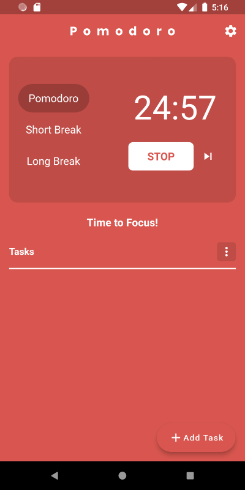

# Pomodoro

The pomodoro technique is a time management framework that will improve your focus and productivity. It encourages you to work within the time you have, rather than struggle against it.

You will finish each day with a sense of accomplishment by doing nothing more than working in 25-minute blocks (called pomodoro sessions), followed by 5-minute breaks.

The pomodoro technique is popular with freelancers wanting to track time, students wishing to study more effectively and anyone looking to improve themselves at work or in their personal projects.

The pomodoro technique is simple, yet very effective.

### Screenshots
Idle State            |  Timer Running State
:-------------------------:|:-------------------------:
  |  

