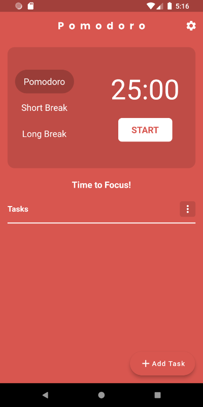
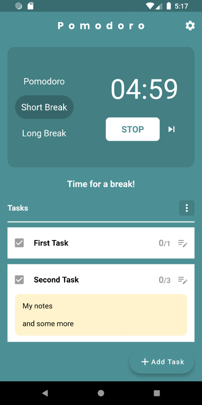
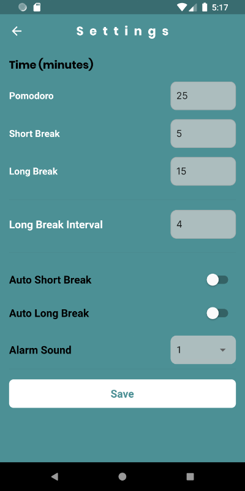

# Pomodoro

The pomodoro technique is a time management framework that will improve your focus and productivity. It encourages you to work within the time you have, rather than struggle against it.

You will finish each day with a sense of accomplishment by doing nothing more than working in 25-minute blocks (called pomodoro sessions), followed by 5-minute breaks.

The pomodoro technique is popular with freelancers wanting to track time, students wishing to study more effectively and anyone looking to improve themselves at work or in their personal projects.

The pomodoro technique is simple, yet very effective.

## How to use the Pomodoro Timer?
1. Add tasks to work on today
2. Set estimate pomodoros (1 = 25min of work) for each tasks
3. Select a task to work on
4. Start timer and focus on the task for 25 minutes
5. Take a break for 5 minutes when the alarm ring
6. Iterate 3-5 until you finish the tasks
7. Change the times as per your need from the settings

## Features
- Multi-platform app; can run in android, iOS, web and desktop 
- Color transition to switch moods between work time and rest time
- Audio with push notification at the end of a timer period
- Customizable timer intervals as per your need

### Screenshots
Idle State            |  Timer Running State
:-------------------------:|:-------------------------:
  |  

Tasks added            |  Settings
:-------------------------:|:-------------------------:
  |  
